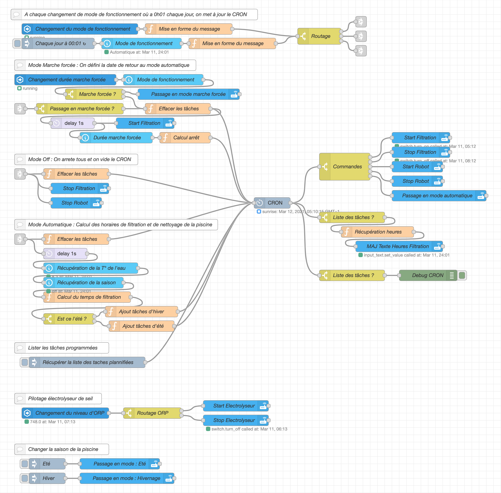

Flow : Gestion de la piscine
============================

## Principe de fonctionnement

Tous est organisé autour du noeud cron-plus : https://flows.nodered.org/node/node-red-contrib-cron-plus. Celui-ci est l'ordonnanceur de gestion de la piscine. Chaque jour à minuit et une minute ou l'orsque une donnée lié à la piscine change dans Home Assistant, les tâches se réinitialisent en fonction du mode de fonctionnement :
- Si mode automatique :
  - Si hiver : Filtration de la piscine 2h avant le levé du soleil et 1h après le levé du soleil
  - Si saison : Calcul du temps de filtration en fonction de la température de l’eau et filtration la moitié du temps avant 13h, la moitié du temps après 13h. Mise en marche du robot de la piscine en même temps que la filtration puis extinction 150 minutes plus tard.
- Si mode marche forcée : Mise en marche de la filtration puis en fonction de l'input de durée (entre 1 jour et 1 semaine)repassage en mode automatique à la fin de cette durée.
- Si mode arrêt forcé : Arrêt de tout les équipement et le CRON est vidé

En parallèle de la gestion de la filtration et du robot de piscine, l'allumage ou l'extinction de l'électrolyseur de sel est automatisé. Si le potentiel RedOX est supérieur à 750 l'électrolyseur s'éteint et si il est inférieur à 675, il se met en marche.

## Entités à créer

Voici les entités que à créé dans Home Assistant pour être utilisée par le flow :
- input_boolean.swimming_season pour savoir si on est en hivernage (false) ou en saison d'utilisation de la piscine (true).
- input_select.pool_pump pour sélectionner le mode de fonctionnement : 
  - Automatique
  - Marche forcée
  - Off
- input_select.pump_forced_duration pour la durée de la marche forcée :
  - 1 jour
  - 2 jours
  - 1 semaine
- input_number.pool_temperature qui contient la température de l’eau
- input_number.pool_orp qui contient le potentiel RedOx de l'eau

## Durée de filtration

L'hivernage étant actif, la filtration a lieu été comme hiver et pour le calcul de la durée de filtration :
- Utilisation de la formule de calcul suivante : duree = (0.00335 * temperature^3) + (-0.14953 * temperature^2) + (2.43489 * temperature) - 10.72859 en prenant au minimun 10°C pour la température de l'eau.
- Ensuite pour assurer une filtration minimun chaque jour et aussi pour ne pas filtrer toute la journée, la durée est bornée à minimun 3h et maximun 14h par jour.
- Dans une v2 du flow, je rajouterais une filtraton de 5 minutes toutes les heures quand la température extérieure est inférieure à 0.

## Flow Node-RED

Voici le lien direct ver [le flow](flow.json) et un apercu visuel de celui-ci :

